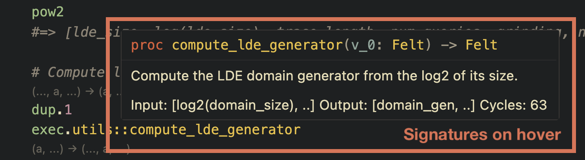
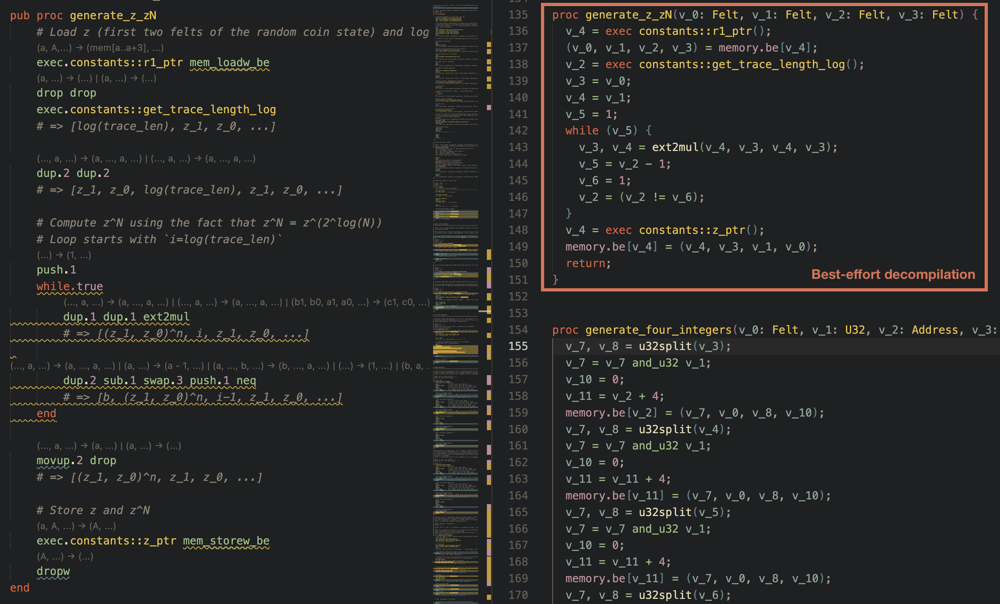

# MASM LSP Server

An LSP server for the [Miden assembly language](https://0xmiden.github.io/miden-vm/user_docs/assembly/main.html) (MASM).

This language server can be run against any IDE that supports the language server protocol. It is installed automatically
by the [VS Code extension for MASM](https://github.com/trailofbits/vscode-masm), but can also be used with other editors
such as Neovim, Emacs, or Sublime Text.

The server provides the following features:

- Go-to-definition and find-references for call targets and constants
- Hover information for call targets and constants
  

    
  

- Diagnostics for syntax errors and undefined symbols
- Inlay hints providing instruction descriptions, or decompilation
  

    
  

- Decompilation of individual procedures or entire files
  

    
  

- Code lenses for instruction stack effects
- Goto symbol definitions and find references.

It also provides diagnostics for a number of simple static analysis passes implemented in the `masm-decompiler` crate,
such as:

- Detecting potential type errors due to insufficient type validation (e.g. treating a `Felt` as an `U32` value)
- Detecting invalid procedure signatures

## References

- [Miden Assembly Language Reference](https://0xmiden.github.io/miden-vm/user_docs/assembly/main.html)
- [Miden VM Documentation](https://0xmiden.github.io/miden-vm/)
- [Miden VM GitHub Repository](https://github.com/0xMiden/miden-vm)
- [Miden stdlib](https://github.com/0xMiden/miden-vm/tree/main/stdlib)
